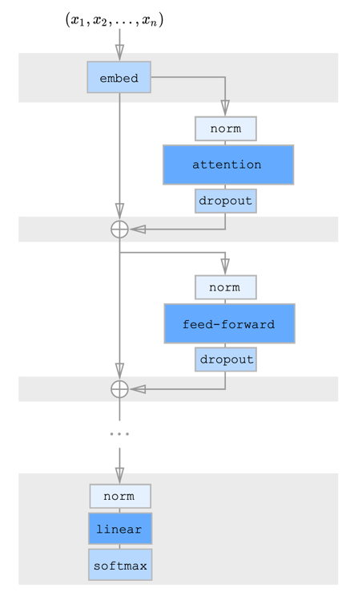

# GPT-Lite
GPT-Lite is a lightweight implementation of the GPT-2 architecture in pytorch.
I had fun implementing this and I have documented my learnings here --> //: blog link

This repo follows the principles outlined in the original GPT-2 architecture but provides flexibility for further experimentation and fine-tuning. The model architecture is built around multi-head self-attention and transformer blocks, making it powerful for generating coherent and contextually aware text.

## Model Overview

The GPT-2 styled model is a decoder-only transformer designed for natural language generation tasks. It generates text one token at a time by predicting the next token in the sequence, conditioned on all previously generated tokens.

Key Features:

* Multi-Head Self-Attention: This mechanism allows the model to attend to different parts of the input sequence simultaneously, enabling better context capturing across multiple layers.
* Positional Encoding: Since transformers are order-agnostic, we add positional encodings to the input embeddings, giving the model a sense of word order.
* Layer Normalization & Residual Connections: These ensure the stability of training by normalizing inputs and adding a shortcut around each sub-layer, which helps gradients flow smoothly.

## Architecture

### Multi-Head Attention

Multi-head attention is the core of the GPT-2 model. It works by applying attention multiple times (using multiple heads) in parallel, allowing the model to focus on different parts of the input sequence.

The input sequence x is transformed through the following steps:

1. Linear Transformations: Queries, keys, and values are generated by linearly projecting x through learned weight matrices.
2. Attention Calculation: Scaled dot-product attention is applied between queries and keys, generating attention scores. These scores are then used to weight the corresponding values.
3. Concatenation & Output Projection: The outputs of all attention heads are concatenated and passed through another linear layer to generate the final output.

### GPT-2 Block

Each block consists of:

1. Self-Attention Layer: This layer allows each token to focus on other tokens in the sequence to generate context-aware representations.
2. Feed-Forward Network (FFN): A two-layer network with a ReLU activation in between, which adds non-linearity and expands the model’s capacity to learn complex patterns.
3. Layer Normalization: Applied both after the attention and FFN sub-layers to stabilize training.
4.	Residual Connections: These shortcut connections help propagate gradients more effectively, addressing vanishing gradient issues in deep networks.

### Output Layer

The final output of the model is passed through a softmax layer to generate the probability distribution over the vocabulary, from which the next token is sampled or selected.

## Components

### MultiHeadAttention

This is the core class responsible for applying multi-head attention. The MultiHeadAttention module is designed to compute attention scores efficiently using Einstein summation notation (einsum) for the dot-product calculations.

Key parameters:

* n_heads: Number of attention heads.
* d_model: Dimension of the model (the embedding size of the input).
* d_head: Dimension per attention head.

It includes methods for:

* Computing attention scores.
* Applying masking to ensure no attention is paid to future tokens (causal masking).
* Efficient bias handling.

### Positional Encoding

Positional encodings are added to the input embeddings to retain the order of words in the sequence. These encodings are static and computed using sine and cosine functions based on the position and dimension of the embeddings.

### FeedForward

The feed-forward layer is a simple fully connected network applied after attention to introduce non-linearity and further project the attention outputs. It’s structured as a two-layer MLP with an activation function (e.g., ReLU).

## Loss Function

The model is trained using the cross-entropy loss function, where the goal is to minimize the difference between the predicted next token and the actual next token in the sequence.

## How it Works

Given a sequence of tokens, the model encodes the input into a hidden representation using embeddings. Then, each token attends to every other token (self-attention), using information from the past (but not the future due to the causal mask). The model repeats this process for each transformer block, refining the hidden representations.

After processing through all blocks, the final layer generates a probability distribution over the vocabulary, predicting the next token in the sequence. The process repeats recursively for autoregressive text generation.